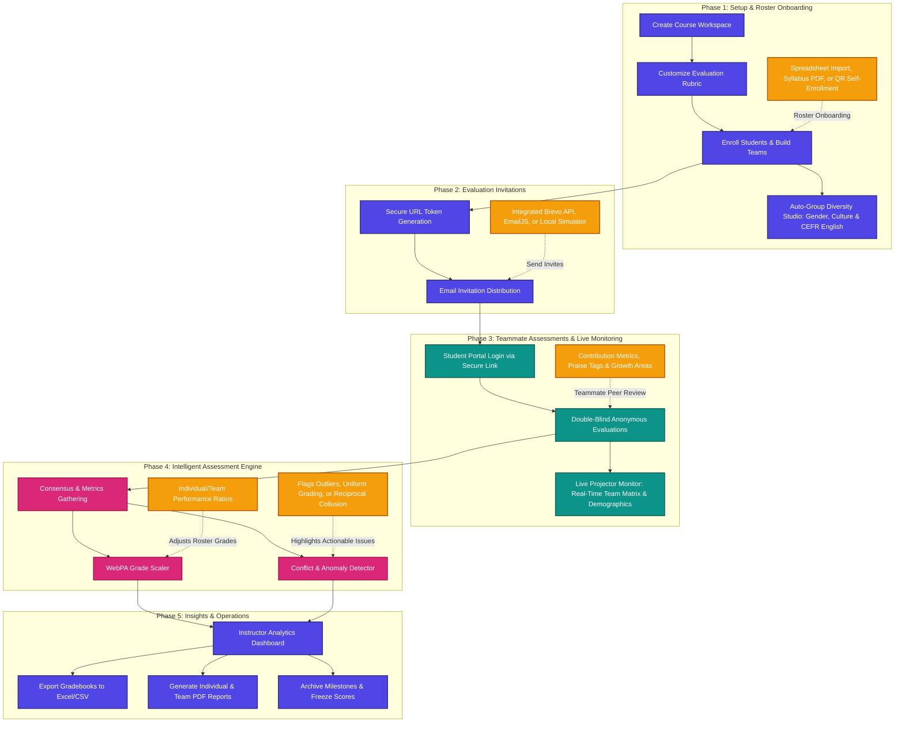

# PeerLens (v2.4)

### *Intelligent Peer Assessment, Simplified.*

**PeerLens** is a premium, state-of-the-art educational peer evaluation platform designed to bring fairness, clarity, and trust to team-based coursework. 

In university, college, and secondary school settings, collaborative group projects are vital for learning—but grading them fairly can be an instructor’s biggest challenge. PeerLens solves this by empowering instructors to customize evaluation rubrics, distribute secure double-blind evaluation portals, and process peer reviews using the internationally recognized **WebPA** grade-adjustment algorithm, automated conflict-detection engines, live classroom projector monitors, and multi-dimensional auto-grouping studios.

---

## <svg xmlns="http://www.w3.org/2000/svg" width="20" height="20" viewBox="0 0 24 24" fill="none" stroke="#4f46e5" stroke-width="2" stroke-linecap="round" stroke-linejoin="round" style="vertical-align: middle; margin-right: 8px;"><path d="M22 12h-4l-3 9L9 3l-3 9H2"/></svg> Peer Assessment Lifecycle

Understanding the double-blind assessment process is straightforward. Here is a high-level flowchart of how PeerLens facilitates the evaluation lifecycle:



---

## <svg xmlns="http://www.w3.org/2000/svg" width="20" height="20" viewBox="0 0 24 24" fill="none" stroke="#9333ea" stroke-width="2" stroke-linecap="round" stroke-linejoin="round" style="vertical-align: middle; margin-right: 8px;"><polygon points="12 2 15.09 8.26 22 9.27 17 14.14 18.18 21.02 12 17.77 5.82 21.02 7 14.14 2 9.27 8.91 8.26 12 2"/></svg> Key Capabilities & Innovation

PeerLens is designed from the ground up to feel extremely premium, responsive, and robust. Here are the core pillars that set PeerLens apart:

### 1. Double-Blind Anonymity & Security
* Students access their private evaluation portals directly through a **secure, encrypted URL parameter link** sent to their email or generated by the instructor.
* No passwords to remember, no user accounts to create, and zero friction.
* Evaluations are strictly anonymous: students only see aggregated team summaries, ensuring completely honest and objective feedback.

### 2. Multi-Method Roster Onboarding & Self-Enrollment
* **QR Code Self-Enrollment Portal**: Project a QR code in class or share a direct link for students to enroll themselves with a 3-section structured profile (Identity, Geographic Status, and Academic Background with CEFR English proficiency and degree suggestion chips).
* **Spreadsheet & PDF Importer**: Drag and drop an Excel spreadsheet, CSV, or syllabus PDF, or simply copy-paste spreadsheet columns from your clipboard. The smart matcher auto-maps headers (Name, Email, Team, ID, Country, CEFR).
* **Dual-Institution Exchange Routing**: Full support for Erasmus and exchange students with separate Home Sending Institution and Host Destination Institution tracking.

### 3. Live Classroom Projector & Presentation View
* **Real-Time Team Matrix**: Live progress ring, visual status indicators (Completed / In Progress / Pending), and average team metrics.
* **Incoming & Unassigned Students Live Dock**: Live detection of newly self-enrolled students with 1-click team assignment, auto-assign to smallest team (`⚡`), and 1-click **Auto-Balance All**.
* **Diversity & Demographics Wall**: Interactive visual wall breaking down countries represented, gender balance ratios, and CEFR English distribution.
* **Big Screen QR Mode**: High-contrast, presentation-optimized QR code display for lecture halls and projector screens.

### 4. Auto-Group Diversity Studio
* **Multi-Dimensional Optimization**: Automatically balance teams across gender parity, cross-cultural representation (195+ countries), and CEFR language proficiency levels.
* **Interactive Kanban Board**: Visual drag-and-drop team builder with live recalculation of team diversity balance scores.
* **Export Individual & Batch Rosters**: Export group breakdowns directly to Excel (`.xlsx`) or CSV.

### 5. WebPA Grade Scaling (Fair Adjustments)
* Applies the internationally recognized **WebPA Scaling Algorithm** to compute individual performance ratios.
* The system analyzes a student’s peer ratings in relation to the team’s average ratings.
* *Example*: If a group project receives a base score of `85/100`, hard-working students are scaled upward automatically (e.g. `92/100`), while underperforming team members are adjusted downward accordingly, promoting full group accountability.

### 6. Smart Conflict & Anomaly Auditing
Anomalies and grading bias are spotted instantly by the built-in grading audit engine, highlighting actionable concerns for the instructor:
* <svg xmlns="http://www.w3.org/2000/svg" width="16" height="16" viewBox="0 0 24 24" fill="none" stroke="#f59e0b" stroke-width="2" stroke-linecap="round" stroke-linejoin="round" style="vertical-align: middle; margin-right: 6px;"><circle cx="12" cy="12" r="10"/><line x1="8" y1="12" x2="16" y2="12"/></svg> **Uniform/Lazy Grading**: Flags students who rate everyone on their team identically.
* <svg xmlns="http://www.w3.org/2000/svg" width="16" height="16" viewBox="0 0 24 24" fill="none" stroke="#ef4444" stroke-width="2" stroke-linecap="round" stroke-linejoin="round" style="vertical-align: middle; margin-right: 6px;"><polygon points="7.86 2 16.14 2 22 7.86 22 16.14 16.14 22 7.86 22 2 16.14 2 7.86 7.86 2"/><line x1="12" y1="8" x2="12" y2="12"/><line x1="12" y1="16" x2="12.01" y2="16"/></svg> **Spiteful Outlier Ratings**: Flags extreme negative ratings given to a student that contradict the rest of the team's consensus.
* <svg xmlns="http://www.w3.org/2000/svg" width="16" height="16" viewBox="0 0 24 24" fill="none" stroke="#3b82f6" stroke-width="2" stroke-linecap="round" stroke-linejoin="round" style="vertical-align: middle; margin-right: 6px;"><path d="M17 21v-2a4 4 0 0 0-4-4H5a4 4 0 0 0-4 4v2"/><circle cx="9" cy="7" r="4"/><path d="M23 21v-2a4 4 0 0 0-3-3.87"/><path d="M16 3.13a4 4 0 0 1 0 7.75"/></svg> **Reciprocal Collusion**: Automatically detects "grading circles" (e.g. two students who agree to give each other perfect scores, despite poor ratings from their other teammates).

### 7. Unified Settings Hub & Cloud Synchronization
* **Brevo API & EmailJS Integration**: Direct API-level email distribution for classroom rosters with custom sender name and email headers.
* **Firebase Cloud Sync**: Real-time multi-device cloud synchronization with offline-first local storage fallback.
* **Customizable Keyboard Shortcuts**: Fully customizable global shortcuts for rapid navigation, filtering, exporting, and presentation modes.

---

## <svg xmlns="http://www.w3.org/2000/svg" width="20" height="20" viewBox="0 0 24 24" fill="none" stroke="#0d9488" stroke-width="2" stroke-linecap="round" stroke-linejoin="round" style="vertical-align: middle; margin-right: 8px;"><path d="M4 19.5A2.5 2.5 0 0 1 6.5 17H20"/><path d="M6.5 2H20v20H6.5A2.5 2.5 0 0 1 4 19.5v-15A2.5 2.5 0 0 1 6.5 2z"/></svg> Step-by-Step User Guide

### <svg xmlns="http://www.w3.org/2000/svg" width="18" height="18" viewBox="0 0 24 24" fill="none" stroke="#4f46e5" stroke-width="2" stroke-linecap="round" stroke-linejoin="round" style="vertical-align: middle; margin-right: 8px;"><path d="M16 21v-2a4 4 0 0 0-4-4H6a4 4 0 0 0-4 4v2"/><circle cx="9" cy="7" r="4"/><path d="m16 11 2 2 4-4"/></svg> For Instructors (Admins)
1. **Create your course**: Name your workspace (e.g., *Software Engineering Capstone - Spring 2026*).
2. **Define the Rubric**: Customize the grading criteria, score ranges, weights, and descriptions (e.g., Quality of Contribution, Reliability, and Collaboration).
3. **Enroll Students**: Import rosters via Excel/CSV/PDF, add students manually, or display the **Classroom QR Code** for real-time student self-enrollment.
4. **Optimize Groups**: Open the **Auto-Group Diversity Studio** to balance teams by gender parity, cultural backgrounds, and CEFR English fluency.
5. **Distribute Portals**: Dispatch private double-blind student evaluation links via **Brevo API**, **EmailJS**, or the Fast Link Dispatcher.
6. **Live Classroom Monitoring**: Open **Projector View** during evaluation sessions to monitor team progress and assign incoming students in real time.
7. **Review Analytics & Export**: Inspect WebPA metrics, standard deviations, and flagged anomalies. Export full gradebooks to Excel or generate individual PDF student reports.

### <svg xmlns="http://www.w3.org/2000/svg" width="18" height="18" viewBox="0 0 24 24" fill="none" stroke="#0d9488" stroke-width="2" stroke-linecap="round" stroke-linejoin="round" style="vertical-align: middle; margin-right: 8px;"><path d="M16 21v-2a4 4 0 0 0-4-4H6a4 4 0 0 0-4 4v2"/><circle cx="9" cy="7" r="4"/><path d="M22 21v-2a4 4 0 0 0-3-3.87"/><path d="M16 3.13a4 4 0 0 1 0 7.75"/></svg> For Students
1. **Open Secure Link**: Click the private link received via email or self-enroll via classroom QR code.
2. **Review Roster**: PeerLens automatically displays your team members under double-blind token security.
3. **Assess Contributions**: Rate teammates across each criterion using intuitive slider controls.
4. **Provide Constructive Feedback**: Choose positive praise tags (e.g., *Creative Problem Solver*, *Reliable & Punctual*) and write constructive feedback for strengths and growth areas.
5. **Submit**: Submit your evaluation—ratings are saved securely and anonymously.

---

## <svg xmlns="http://www.w3.org/2000/svg" width="20" height="20" viewBox="0 0 24 24" fill="none" stroke="#059669" stroke-width="2" stroke-linecap="round" stroke-linejoin="round" style="vertical-align: middle; margin-right: 8px;"><polyline points="4 17 10 11 4 5"/><line x1="12" y1="19" x2="20" y2="19"/></svg> Quickstart & Setup

### Live Deployment
PeerLens is fully compiled and hosted on **Netlify**:
* <svg xmlns="http://www.w3.org/2000/svg" width="16" height="16" viewBox="0 0 24 24" fill="none" stroke="#4f46e5" stroke-width="2" stroke-linecap="round" stroke-linejoin="round" style="vertical-align: middle; margin-right: 6px;"><path d="M10 13a5 5 0 0 0 7.54.54l3-3a5 5 0 0 0-7.07-7.07l-1.72 1.71"/><path d="M14 11a5 5 0 0 0-7.54-.54l-3 3a5 5 0 0 0 7.07 7.07l1.71-1.71"/></svg> **[PeerLens Live Application](http://peerlenses.netlify.app/)**

### Running Locally
To run PeerLens locally for development or testing:

1. **Clone the repository**:
   ```bash
   git clone https://github.com/your-username/PeerLens.git
   cd PeerLens
   ```
2. **Install dependencies**:
   ```bash
   npm install
   ```
3. **Launch the development server**:
   ```bash
   npm run dev
   ```
4. **Build for production**:
   ```bash
   npm run build
   ```

---

## <svg xmlns="http://www.w3.org/2000/svg" width="20" height="20" viewBox="0 0 24 24" fill="none" stroke="#e11d48" stroke-width="2" stroke-linecap="round" stroke-linejoin="round" style="vertical-align: middle; margin-right: 8px;"><rect x="3" y="11" width="18" height="11" rx="2" ry="2"/><path d="M7 11V7a5 5 0 0 1 10 0v4"/></svg> Trust & Privacy Guidelines

* **Local Sovereignty**: All roster lists, names, and emails are processed strictly client-side. PeerLens does not collect or sell course data.
* **Encryption by Default**: Student URLs are tokens compiled from administrative API values, keeping student information masked.
* **Transactional Reliability**: Firebase synchronization relies on atomic Firestore database transactions, ensuring student reviews never overwrite each other even if submitted at the exact same split-second.

---

## <svg xmlns="http://www.w3.org/2000/svg" width="20" height="20" viewBox="0 0 24 24" fill="none" stroke="#d97706" stroke-width="2" stroke-linecap="round" stroke-linejoin="round" style="vertical-align: middle; margin-right: 8px;"><path d="M14.5 2H6a2 2 0 0 0-2 2v16a2 2 0 0 0 2 2h12a2 2 0 0 0 2-2V7.5L14.5 2z"/><polyline points="14 2 14 8 20 8"/></svg> License

Distributed under the **MIT License**. See `LICENSE` for details.
