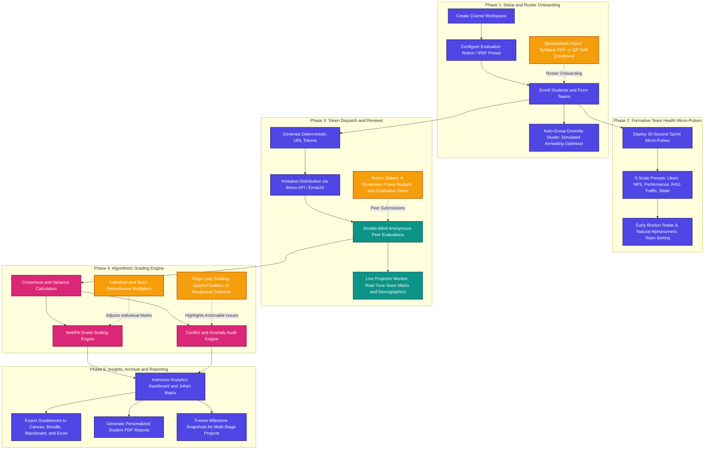

# PeerLens

### *Intelligent Peer Assessment, Simplified.*

**PeerLens** is an educational peer evaluation and team analytics platform designed to bring fairness, transparency, and collaborative accountability to team-based university coursework.

In higher education, collaborative group projects are vital for student learning, yet assessing individual contributions within a shared team deliverable remains a significant pedagogical challenge. PeerLens solves this problem by providing instructors with psychometrically validated evaluation rubrics, continuous formative **Team Health Micro-Pulses**, passwordless double-blind student portals, auditorium presentation monitors, multi-dimensional auto-grouping studios, and an automated grade-adjustment engine powered by the internationally recognized **Loughborough WebPA algorithm**.

---

## Peer Assessment Lifecycle

The double-blind evaluation lifecycle in PeerLens operates through five structured phases:



---

## Core Capabilities and Architecture

PeerLens is structured around three sequential operational sections and a powerful workflow accelerator suite:

### Section 1: Student Enrollment and AutoGroup Studio
* **Multi-Format Roster Ingestion**: Drag-and-drop Excel (`.xlsx`), CSV, or syllabus PDF rosters. The heuristic column matcher auto-associates columns for Student Name, Email, Team, Student ID, Nationality, Gender, and CEFR English level.
* **Live Classroom QR Self-Enrollment**: Project a high-contrast QR code during lecture sessions for students to register with their mobile devices, capturing geographic origin, exchange status, and degree details.
* **AutoGroup Diversity Studio**: Combinatorial team formation powered by a **Simulated Annealing** multi-objective optimizer. Simultaneously balances gender parity, cross-cultural representation across 195+ countries, CEFR language skills, and historical partner avoidance to prevent insular cliques.
* **Automated Collision Protection**: Scans incoming enrollments for duplicate IDs or emails, providing single-click options to update existing records, merge profiles, or discard duplicate rows safely.
* **Batch Roster Actions**: Multi-select toolbar supporting 1-click team transfers, individual resend tokens, and bulk roster pruning.

### Section 2: Review System, Form Governance & Team Health Pulse
* **Integrated Peer Assessment Framework (IPAF)**: Research-synthesized rubric combining observable task deliverables with interpersonal process metrics across six dimensions: *Contribution Quality* (20%), *Reliability* (20%), *Problem-Solving* (15%), *Communication* (15%), *Initiative* (15%), and *Quality Drive* (15%).
* **Behaviorally Anchored Rating Scales (BARS)**: Clear performance descriptors across four levels (*Unsatisfactory*, *Developing*, *Competent*, *Exemplary*) to guide objective student grading.
* **100% Weight Auto-Balancing**: Dynamic proportional normalization ensuring criteria weights always sum to exactly 100%.
* **Target Scale Conversion**: Automatic normalization of raw criterion ratings into standard institutional systems: Percentage (0 – 100%), European / French (0 – 20), US GPA (0.0 – 4.0), or direct unscaled sums.
* **Team Health "Micro-Pulse" Check-ins**: Deploy lightweight 30-second pulse surveys during active milestones to track student team morale, collaboration velocity, and project roadblocks:
  * *5 Customizable Scale Presets*: Standard 1–5 Likert, 0–10 Net Promoter (NPS), 1–4 Performance Matrix, 1–3 Agile Traffic Light (RAG), and 1–10 Continuous Slider.
  * *Natural Alphanumeric Sorting*: Team matrix displays groups in natural order (`Team 1, Team 2, ..., Team 10, Team 11`).
  * *Multi-Column Sorting & Filtering*: Sort by Team Name, Response Rate, Average Morale, or Status, and filter with 1-click pills (*All*, *Needs Attention*, *Pending Check-ins*, *On Track*).
  * *Early Blocker Radar*: Collects confidential roadblock excerpts alerting instructors to struggling teams weeks before deliverables fail.
  * *Interactive Velocity Sparklines*: Visualizes team morale trajectory across sprint rounds.
* **Evaluation Form Controls & Student Submission Governance**:
  * *Self-Review Calibration*: Toggle self-evaluation inclusion (strictly segregated from WebPA multiplier math to avoid grade inflation).
  * *Peer Praise Badges (6 Dimensions)*: Enable positive recognition tags across *Innovation & Creativity*, *Technical Execution*, *Dependability & Grit*, *Team Collaboration*, *Leadership & Initiative*, and *Critical Problem Solving*.
  * *Role Baselines*: Define project role archetypes (Lead Developer, Project Manager, Researcher) so students evaluate peers relative to designated responsibilities.
  * *Student Profile Locks*: Freeze student names, emails, and group allocations after university drop/add census dates to guarantee audit integrity.
* **Interactive Evaluation Simulator**: Test the exact smartphone peer review experience your students see before publishing evaluation rounds.

### Section 3: Performance Analytics and WebPA Calibrator
* **Loughborough WebPA Scaling Algorithm**: Normalizes individual peer evaluations against team averages to derive performance multipliers ($R_i$), distinguishing leadership contributions from social loafing.
* **Stabilization Fudge Weight Slider**: Configurable damping slider ($f \in [0.0, 1.0]$) balancing team deliverable marks with individual peer differentiation. A 50% setting ($f = 0.50$) provides standard balance, while 0% preserves uniform team grading and 100% yields pure peer-driven marks.
* **Per-Team Base Project Marks**: Instructors can assign distinct baseline grades to each group deliverable; WebPA scales individual marks proportionally around each team's respective score.
* **Johari Perception Window**: Classifies self-vs-peer score alignment into four distinct quadrants using a ±7.5% deviation threshold:
  * *Open Arena* (High Self, High Peer): Validated competence and mutual confidence.
  * *Blind Spot* (Low Self, High Peer): Under-recognized talent or impostor syndrome.
  * *Hidden Facade* (High Self, Low Peer): Over-confidence or unperceived team friction.
  * *Unknown* (Low Self, Low Peer): Group disengagement requiring instructor intervention.
* **Competency Radar Spider Overlay**: Visual multi-axis chart contrasting individual student ratings against team and cohort benchmarks.
* **Statistical Anomaly and Collusion Auditing**: Automated detection flags uniform grading (zero standard deviation), outlier rater divergence (> 1.5 standard deviations from team consensus), and reciprocal collusion circles ($r > 0.85$ mutual score pacts).

---

## Workflow Productivity Suite

* **Quick Action Center & Floating Utility Dock**: Persistent, high-accessibility dock anchored at the bottom of the interface. Expand to toggle modules across all 3 sections on the fly, jump tabs, switch classrooms, or launch administrative tools.
* **Omni Command Palette (`Ctrl + K` / `Cmd + K` or `/`)**: Keyboard-driven workflow accelerator with natural language intent detection, direct gradebook exports, section navigation, and filter jumpers.
* **Minimalist, Silky-Smooth Interactive Tour**: Redesigned 60–120 FPS spotlight walkthrough with zero scrolling lag, GPU-composited positioning, concise 1–2 sentence overviews, and 100% voluntary, on-demand activation.
* **30-Second Safety Net Action Undo (`Ctrl + Z`)**: Reversible deletion safety net with animated toasts, allowing instant recovery of accidentally removed students, rubrics, or classrooms without corrupting cloud sync.
* **Interface Density Presets**: Switch instantly between *Minimal* (distraction-free baseline), *Standard* (balanced default), and *Customized* (toggle any of the 40+ widgets individually).
* **Live Classroom Projector Mode (`P`)**: Presentation-optimized monitor displaying live submission rings, incoming student dock with auto-assignment, and cohort diversity metrics readable from over 25 meters across lecture halls.
* **1-Click Multi-Format Export Suite**:
  * *Canvas LMS Gradebook*: SIS User ID compliant CSV with assignment points.
  * *Moodle LMS*: XML and CSV formats matching grade import specifications.
  * *Blackboard Learn*: Tab-delimited batch upload format.
  * *Brightspace D2L*: Standard CSV grade item schema.
  * *Multi-Sheet Excel Workbook*: Sheet 1 containing scaled grades and multipliers; Sheet 2 detailing raw criterion evaluations.
  * *Individual Student PDF Reports*: Batch-generated personalized report cards with radar charts and anonymized qualitative peer comments.
* **Milestone Longitudinal Archival**: Freeze completed evaluation rounds for multi-sprint coursework, enabling progression tracking over consecutive project milestones.

---

## Operational Manual and Guidance Center

PeerLens includes comprehensive documentation directly integrated into the software:

* **Complete Institutional Operational Manual**: Accessible via the `/guide` and `/manual` routes and new-tab launcher buttons. Contains 17 in-depth chapters covering pedagogical theory, mathematical derivations, worked numerical examples, LMS integration schemas, and diagnostic FAQs.
* **Academic Guidance Center**: Modal interface featuring 6 focused spotlight tour tracks, pedagogical architecture overviews, and an indexed Feature Knowledge Base searchable via `/`.

---

## Data Privacy, Security and Governance

* **Client-Side Local Sovereignty**: All student rosters, emails, and ratings are stored in browser Web Storage. PeerLens operates fully offline without mandatory cloud dependencies.
* **Double-Blind Anonymity**: Students access private evaluation portals via HMAC-signed, deterministic URL tokens without creating passwords or third-party accounts. Qualitative feedback is anonymized and shuffled before presentation.
* **Optional Firebase Cloud Synchronization**: Instructors can configure an optional Firebase project for multi-device continuity, utilizing atomic Firestore transactions and strict user-scoped security rules.
* **GDPR Compliance**: Instant roster purging and complete data reset capabilities with zero persistent advertising cookies or tracking telemetry.

---

## Technical Stack

* **Frontend Framework**: React 19, TypeScript
* **Build Tooling**: Vite 8, Rolldown bundler
* **Styling**: Vanilla CSS design system with custom tokens (dark/light themes, zero utility-framework bloat)
* **Cloud Layer**: Optional Firebase Firestore (real-time listeners, atomic transactions)
* **Email Protocols**: Brevo REST API, EmailJS
* **Reporting Engines**: jsPDF, jsPDF-AutoTable, SheetJS (XLSX)
* **Icons**: Lucide React

---

## Quickstart and Local Development

### Prerequisites
* Node.js version 20 or later
* npm version 10 or later

### Installation Steps
1. Clone the repository:
   ```bash
   git clone https://github.com/Dhruu04/PeerLens.git
   cd PeerLens
   ```

2. Install dependencies:
   ```bash
   npm install
   ```

3. Start the local development server:
   ```bash
   npm run dev
   ```

4. Build the production bundle:
   ```bash
   npm run build
   ```

---

## Deployment Configuration

PeerLens is production-ready for deployment to static hosting platforms and cloud providers:

### Netlify Deployment
PeerLens includes pre-configured [`netlify.toml`](netlify.toml) and [`public/_redirects`](public/_redirects):
* **Build Command**: `npm run build`
* **Publish Directory**: `dist`
* **Direct Documentation Routing**: Clean rewrites for `/guide`, `/manual`, and `/docs` serving the comprehensive manual with revalidation headers.
* **SPA Routing**: Automatic rewrite of all application paths `/*` to `/index.html` with HTTP 200 OK.
* **PWA & Cache Headers**: Long-term immutable caching for `/assets/*` and instant revalidation for `/guide.html`, `/sw.js`, and `/manifest.webmanifest`.

### Firebase Hosting Deployment
PeerLens includes pre-configured [`firebase.json`](firebase.json) and [`firestore.rules`](firestore.rules):
1. Install Firebase CLI and login:
   ```bash
   npm install -g firebase-tools
   firebase login
   ```
2. Initialize and deploy:
   ```bash
   firebase deploy --only hosting,firestore
   ```
* **Hosting**: Configured for `dist` directory with SPA fallbacks, direct manual routing, and security headers.
* **Firestore Security**: Scoped rules ensuring course convenors retain exclusive administrative authority while allowing authenticated students to read active rubrics and submit peer evaluations or 30-second health pulses.

---

## License

Distributed under the **MIT License**. See `LICENSE` for details.
