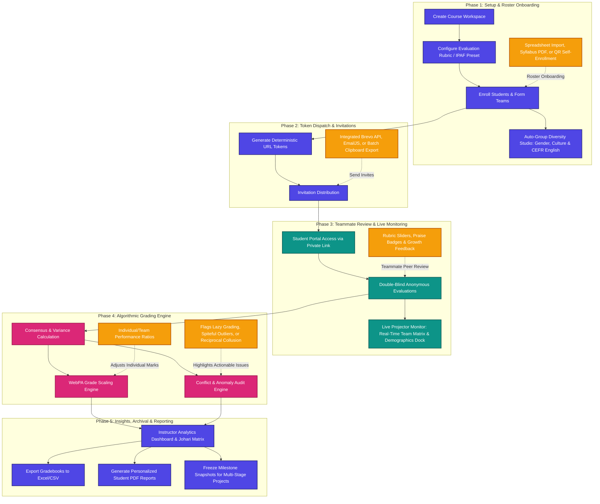

# PeerLens (v2.4)

### *Intelligent Peer Assessment, Simplified.*

**PeerLens** is a premium, state-of-the-art educational peer evaluation platform designed to bring fairness, transparency, and collaborative accountability to team-based university coursework.

In higher education, collaborative group projects are vital for student learning—yet assessing individual contributions within a shared team deliverable remains a significant pedagogical challenge. PeerLens addresses this problem by providing instructors with psychometrically validated evaluation rubrics, passwordless double-blind student portals, real-time classroom presentation monitors, multi-dimensional auto-grouping studios, and an automated grade-adjustment engine powered by the internationally recognized **WebPA algorithm**.

---

## <svg xmlns="http://www.w3.org/2000/svg" width="20" height="20" viewBox="0 0 24 24" fill="none" stroke="#4f46e5" stroke-width="2" stroke-linecap="round" stroke-linejoin="round" style="vertical-align: middle; margin-right: 8px;"><path d="M22 12h-4l-3 9L9 3l-3 9H2"/></svg> Peer Assessment Lifecycle

The double-blind evaluation lifecycle in PeerLens operates through five structured phases:



---

## <svg xmlns="http://www.w3.org/2000/svg" width="20" height="20" viewBox="0 0 24 24" fill="none" stroke="#9333ea" stroke-width="2" stroke-linecap="round" stroke-linejoin="round" style="vertical-align: middle; margin-right: 8px;"><polygon points="12 2 15.09 8.26 22 9.27 17 14.14 18.18 21.02 12 17.77 5.82 21.02 7 14.14 2 9.27 8.91 8.26 12 2"/></svg> Core Capabilities & Innovations

PeerLens is built from the ground up to feel responsive, robust, and pedagogically sound. Key architectural features include:

### 1. Double-Blind Anonymity & Passwordless Token Security
* Students access their private evaluation portals through unique, deterministic URL tokens generated by the platform.
* Zero-account friction: no password creation, login credentials, or account management overhead.
* Strictly anonymous: students only see aggregated team scores. Individual reviewer ratings are cryptographically masked to ensure honest, unbiased evaluations.

### 2. Multi-Method Roster Onboarding & QR Self-Enrollment
* **Live QR Code Self-Enrollment**: Project a high-contrast QR code in lecture halls for students to register with their phones. Captures identity, geographic mobility status, degree program, and CEFR English level.
* **Spreadsheet & PDF Ingestion**: Drag and drop Excel (`.xlsx`), CSV, or syllabus PDF rosters. The smart regex header matcher auto-associates columns for Name, Email, Group, Student ID, Nationality, and CEFR level.
* **Duplicate Detection Engine**: Automatically scans for duplicate enrollments or conflicting entries with one-click merge or discard options.
* **Exchange & Mobility Tracking**: Built-in support for international and Erasmus exchange students with dual Home Sending and Host Destination institution routing.

### 3. Integrated Peer Assessment Framework (IPAF) Rubric Standard
* Pre-configured with a research-grounded rubric synthesized from five validated higher education instruments (CATME, Salas Big Five, AAC&U VALUE, WebPA, Falchikov & Goldfinch).
* Evaluates six core dimensions balanced across task contribution and collaborative process:
  1. *Contribution Quality* (20% weight, Task Output)
  2. *Reliability & Dependability* (20% weight, Dependability)
  3. *Problem-Solving* (15% weight, Cognitive Process)
  4. *Communication* (15% weight, Interpersonal)
  5. *Initiative & Leadership* (15% weight, Proactivity)
  6. *Quality Drive* (15% weight, Standards & Excellence)
* Features Behaviorally Anchored Rating Scale (BARS) guidance indicators and strict 100% weight validation with automatic normalization.

### 4. Auto-Group Diversity Studio
* **Multi-Objective Optimization**: Automatically forms balanced project teams using a combinatorial optimizer that maximizes a Composite Diversity Score (CDS).
* **Multi-Dimensional Balance**: Balances gender parity, cross-cultural representation across 195+ supported nationalities, and CEFR language proficiency levels simultaneously.
* **Interactive Drag-and-Drop Kanban**: Visual team board allowing manual reassignment of students with live recalculation of team diversity balance scores.
* **Roster Exports**: Export proposed teams directly to formatted Excel (`.xlsx`) or CSV files.

### 5. WebPA Grade Scaling Engine
* Implements the validated **WebPA Scaling Algorithm** originally developed at Loughborough University.
* Analyzes individual peer ratings relative to the team's collective average score to derive an individual performance ratio ($R_i$).
* Applies a stabilization fudge factor ($f = 0.5$) to protect the integrity of the base group mark while rewarding high contributors and penalizing social loafing.
* *Example*: For a team deliverable graded at 82/100, an exceptional contributor with a WebPA ratio of 1.189 receives an adjusted grade of 89.7/100, while a non-contributing teammate with a ratio of 0.757 is scaled to 72.0/100.

### 6. Automated Conflict & Anomaly Auditing
Real-time statistical anomaly detection flags potential grading bias for instructor review:
* <svg xmlns="http://www.w3.org/2000/svg" width="16" height="16" viewBox="0 0 24 24" fill="none" stroke="#f59e0b" stroke-width="2" stroke-linecap="round" stroke-linejoin="round" style="vertical-align: middle; margin-right: 6px;"><circle cx="12" cy="12" r="10"/><line x1="8" y1="12" x2="16" y2="12"/></svg> **Uniform / Lazy Grading**: Flags reviewers who assign identical scores ($\sigma = 0.00$) across all criteria to all teammates to avoid conflict.
* <svg xmlns="http://www.w3.org/2000/svg" width="16" height="16" viewBox="0 0 24 24" fill="none" stroke="#ef4444" stroke-width="2" stroke-linecap="round" stroke-linejoin="round" style="vertical-align: middle; margin-right: 6px;"><polygon points="7.86 2 16.14 2 22 7.86 22 16.14 16.14 22 7.86 22 2 16.14 2 7.86 7.86 2"/><line x1="12" y1="8" x2="12" y2="12"/><line x1="12" y1="16" x2="12.01" y2="16"/></svg> **Outlier Rating Discrepancy**: Flags individual scores deviating more than 30 percentage points from consensus team averages (spiteful low ratings or unearned high marks).
* <svg xmlns="http://www.w3.org/2000/svg" width="16" height="16" viewBox="0 0 24 24" fill="none" stroke="#3b82f6" stroke-width="2" stroke-linecap="round" stroke-linejoin="round" style="vertical-align: middle; margin-right: 6px;"><path d="M17 21v-2a4 4 0 0 0-4-4H5a4 4 0 0 0-4 4v2"/><circle cx="9" cy="7" r="4"/><path d="M23 21v-2a4 4 0 0 0-3-3.87"/><path d="M16 3.13a4 4 0 0 1 0 7.75"/></svg> **Reciprocal Collusion Circles**: Detects mutual score-inflation pacts where two students give each other perfect marks ($\ge 90\%$) despite lower peer evaluations from the rest of the group.

### 7. Live Classroom Projector View
* **Team Submission Rings**: Visual indicators displaying Completed (green), In Progress (amber), and Pending (grey) review states.
* **Incoming Students Live Dock**: Real-time detection of students enrolling via QR code, with 1-click team assignment and an Auto-Balance All (`⚡`) utility.
* **Demographics Wall**: Dynamic cohort statistics showing international diversity, gender parity ratios, and CEFR English levels.
* **Lecture Hall QR Display**: High-contrast, presentation-optimized QR mode readable from anywhere in the classroom.

### 8. Bidirectional Cloud Sync & Offline-First Architecture
* **Firebase Firestore Sync**: Multi-device synchronization with atomic array transactions ensuring concurrent submissions never overwrite each other.
* **State Sanitization**: Strict data serialization (`sanitizeClassForFirestore`) guaranteeing safe null-handling, date serialization, and backward compatibility.
* **Local Data Sovereignty**: Operates offline-first using client-side Web Storage with background cloud synchronization.

### 9. True Dark Theme & Adaptive Multi-Accent System
* **Obsidian / Zinc Dark Mode**: Deep-black, high-contrast dark theme engineered to eliminate visual fatigue.
* **Adaptive Color Palettes**: Five color schemes (Indigo, Violet, Emerald/Teal, Amber, Rose) dynamically tuning UI elements, charts, and status badges.
* **Minimalist Toggle**: Unobtrusive theme switcher positioned cleanly in the primary navigation.

### 10. Mobile-First Ergonomics
* Rebuilt responsive layout with adaptive 2x2 and 4-column button grids (`repeat(auto-fit, minmax(130px, 1fr))`).
* Touch-calibrated sliders, bottom-sheet dialogs, and mobile-friendly evaluation portals for seamless completion on smartphones and tablets.

### 11. Interactive Guided Onboarding
* **Guided Sandbox HUD**: Mission-based walkthrough assisting first-time instructors through setup, rubric configuration, and review simulation.
* **Universal Command Palette**: Quick access to any action via `Ctrl + K`.
* **Keyboard Accelerator Registry**: Customizable shortcuts for rapid navigation (`P` for Projector View, `Ctrl + E` for Excel export, `Ctrl + G` for Auto-Group Studio).

---

## <svg xmlns="http://www.w3.org/2000/svg" width="20" height="20" viewBox="0 0 24 24" fill="none" stroke="#0d9488" stroke-width="2" stroke-linecap="round" stroke-linejoin="round" style="vertical-align: middle; margin-right: 8px;"><path d="M4 19.5A2.5 2.5 0 0 1 6.5 17H20"/><path d="M6.5 2H20v20H6.5A2.5 2.5 0 0 1 4 19.5v-15A2.5 2.5 0 0 1 6.5 2z"/></svg> Step-by-Step User Workflows

### For Instructors (Administrators)
1. **Initialize Workspace**: Click **"+ New Class"** and name your course section.
2. **Configure Evaluation Rubric**: Select the built-in **IPAF Preset** or customize criteria, weights, and score ranges.
3. **Ingest Student Roster**: Import rosters via Excel/CSV/PDF, add students manually, or display the **Classroom QR Code** for live self-enrollment.
4. **Balance Teams**: Open the **Auto-Group Diversity Studio** to optimize team balance across gender, nationality, and English proficiency.
5. **Dispatch Evaluation Tokens**: Distribute private evaluation links via **Brevo API**, **EmailJS**, or batch clipboard export.
6. **Monitor Evaluation Session**: Launch **Projector View** (`P`) during live class sessions to monitor completion and assign incoming students.
7. **Audit & Review Results**: Inspect WebPA adjustment ratios, consensus standard deviations, and flagged anomaly alerts.
8. **Export & Archive**: Export final gradebooks to Excel (`.xlsx`), generate personalized student PDF feedback reports, and freeze longitudinal milestone snapshots.

### For Students
1. **Open Evaluation Link**: Access your private portal via the tokenized link sent by your instructor or displayed after QR enrollment.
2. **Review Team Roster**: PeerLens automatically loads your teammates under double-blind token security.
3. **Score Teammates**: Evaluate each peer across criteria using intuitive sliders calibrated by behavioral indicators.
4. **Select Recognition Badges**: Acknowledge peer strengths with positive praise badges (*Creative Problem Solver*, *Reliable & Punctual*, *Supportive Team Player*, etc.).
5. **Provide Constructive Feedback**: Write anonymized comments highlighting strengths and actionable growth areas.
6. **Submit Evaluation**: Lock and submit your evaluation securely.

---

## <svg xmlns="http://www.w3.org/2000/svg" width="20" height="20" viewBox="0 0 24 24" fill="none" stroke="#059669" stroke-width="2" stroke-linecap="round" stroke-linejoin="round" style="vertical-align: middle; margin-right: 8px;"><polyline points="4 17 10 11 4 5"/><line x1="12" y1="19" x2="20" y2="19"/></svg> Quickstart & Installation

### Live Deployment
PeerLens is compiled and hosted on Netlify:
* <svg xmlns="http://www.w3.org/2000/svg" width="16" height="16" viewBox="0 0 24 24" fill="none" stroke="#4f46e5" stroke-width="2" stroke-linecap="round" stroke-linejoin="round" style="vertical-align: middle; margin-right: 6px;"><path d="M10 13a5 5 0 0 0 7.54.54l3-3a5 5 0 0 0-7.07-7.07l-1.72 1.71"/><path d="M14 11a5 5 0 0 0-7.54-.54l-3 3a5 5 0 0 0 7.07 7.07l1.71-1.71"/></svg> **[PeerLens Live Application](http://peerlenses.netlify.app/)**

### Running Locally
To run PeerLens locally for development or testing:

1. **Clone the repository**:
   ```bash
   git clone https://github.com/Dhruu04/PeerLens.git
   cd PeerLens
   ```

2. **Install dependencies**:
   ```bash
   npm install
   ```

3. **Launch local development server**:
   ```bash
   npm run dev
   ```

4. **Build production bundle**:
   ```bash
   npm run build
   ```

---

## <svg xmlns="http://www.w3.org/2000/svg" width="20" height="20" viewBox="0 0 24 24" fill="none" stroke="#3b82f6" stroke-width="2" stroke-linecap="round" stroke-linejoin="round" style="vertical-align: middle; margin-right: 8px;"><polygon points="12 2 2 7 12 12 22 7 12 2"/><polyline points="2 17 12 22 22 17"/><polyline points="2 12 12 17 22 12"/></svg> Technical Stack & Architecture

* **Frontend Framework**: React 19, TypeScript
* **Build System**: Vite 8
* **Styling**: Vanilla CSS with custom design tokens (light/dark mode, adaptive accents, zero Tailwind dependencies)
* **Cloud Infrastructure**: Firebase Firestore (real-time listeners, transactional writes)
* **Email Integrations**: Brevo REST API, EmailJS
* **Reporting Engines**: jsPDF, jsPDF-autotable, SheetJS (XLSX)
* **Icons**: Lucide React

---

## <svg xmlns="http://www.w3.org/2000/svg" width="20" height="20" viewBox="0 0 24 24" fill="none" stroke="#e11d48" stroke-width="2" stroke-linecap="round" stroke-linejoin="round" style="vertical-align: middle; margin-right: 8px;"><rect x="3" y="11" width="18" height="11" rx="2" ry="2"/><path d="M7 11V7a5 5 0 0 1 10 0v4"/></svg> Data Privacy & Governance

* **Local Sovereignty**: All student rosters, emails, and ratings are processed strictly client-side. PeerLens does not track or sell student data.
* **Zero-Account Privacy**: Students access evaluations via encrypted token parameters without creating third-party accounts.
* **Client-Side Export**: Gradebooks and individualized PDF reports render entirely inside the instructor's browser.
* **GDPR Compliance**: Instant roster purging and data reset capabilities with zero persistent server-side tracking cookies.

---

## <svg xmlns="http://www.w3.org/2000/svg" width="20" height="20" viewBox="0 0 24 24" fill="none" stroke="#d97706" stroke-width="2" stroke-linecap="round" stroke-linejoin="round" style="vertical-align: middle; margin-right: 8px;"><path d="M14.5 2H6a2 2 0 0 0-2 2v16a2 2 0 0 0 2 2h12a2 2 0 0 0 2-2V7.5L14.5 2z"/><polyline points="14 2 14 8 20 8"/></svg> License

Distributed under the **MIT License**. See `LICENSE` for details.
